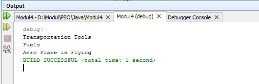
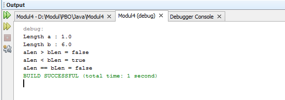
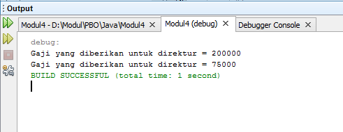
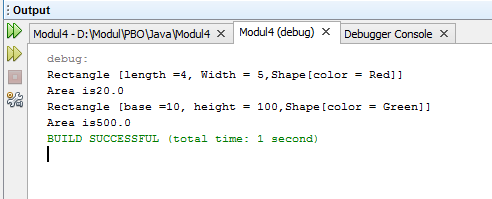

# Modul4

## Latihan 1

### Di program ini class AeroPlan mengambil method dari class Vehicle dengan adanya extends dan di run melalui class AeroPlan dimana class AeroPlan adalah main class di latihan ini dan untuk memanggil method di class yang berbeda dengan cara dibuat variable dari class AeroPlan
## Latihan 2

### Di program ini class Line berfungsi sebagai class tempat operasi aritmatika dijalankan dan di program TestLine akan di test dengan dibuat variable a dan b dan diberi angka-angka acak. setelah itu program dijalankan dan output berdasarkan operasi aritmatika mana saja yang ingin kita munculkan dan bila operasi isGreater, isLess, isEqual ada yang benar dan ada yang salah maka akan muncul true atau false karena tipe data di isGreater, isLess dan isEqual adalah boolean
## Latihan 3

### Di program ini cara kerjanya yaitu class Pegawai menjadi class yang di extends atau mewariskan, dan class Direktur dan Staff mewarisi function gaji dari Pegawai dan di dalam function gaji di class Direktur maupun Staf memiliki nilai masing-masing dan di class PembayaranGaji dimana program akan di run, disini pertama-tama dibuat function hitunggaji dimana direktur dan staf akan di hitung gaji + tunjangannya dan akan di run di method main class
## Latihan 4

### Di program ini cara kerjanya adalah pertama-tama dibuat class shape dimana terdapat 2 function untuk diwariskan ke class Rectangle dan Triangle seperti color dan getArea. Color di class shape sebelum menjadi public color berupa private terlebih dahulu. di class Rectangle, class yang private adalah length dan width dimana ini akan menjadi public bersama dengan color dimana color harus di panggil dengan proses super terlebih dahulu dan di function ToString semua data yang masuk menjadi string dan bisa di munculkan saat di run, setelah itu di function getArea akan mengambil nilai dari length dan width yang kita masukkan. di Class Triangle perbedaan nya hanya di private nya yaitu base dan height dan di getArea adalah base * height /2. di kedua class tersebut mewarisi sifat dari class Shape. setelah itu, program di run melalui class TestShape dimana ini adalah main class untuk menjalankan program.
